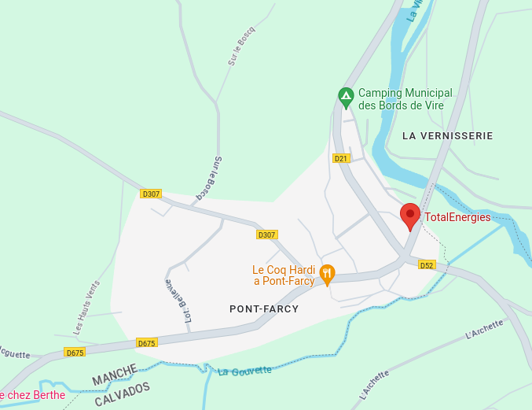

# id: 83380002

| column           | v1              | v2   |
|------------------|-----------------|------|
| adresse          | "SAN PEIRE"     | NULL |
| ville            | "LES ISSAMBRES" | NULL |
| code_departement | "83" Var        | NULL |

**La v1 a raison**

Clairement. La v2 est NULL et qu'il y a bien une station Total
à proximité de la place San Peire aux Issambres.

# id: 83150003

| column           | v1                    | v2   |
|------------------|-----------------------|------|
| adresse          | "CAPITAINERIE DU PORT"| NULL |
| ville            | "BANDOL"              | NULL |
| code_departement | "83" Var              | NULL |

**La v1 a plutôt raison**

La v2 est NULL. Cependant l'emplacement semble étrange, même
si Google Maps semble connaître cette station. Sans-doute se base-t-il
sur ce jeu de données. Aucune pompe n'est visible avec Street View.

# id: 33220001 et 33220004

| column           | v1                            | v2                            |
|------------------|-------------------------------|-------------------------------|
| ville            | "PORT-SAINTE-FOY-ET-PONCHAPT" | "Port-Sainte-Foy-et-Ponchapt" |
| code postal      | "33220"                       | "33220"                       |
| code_departement | "33" Gironde                  | "24" Dordogne                 |

**La v2 a raison**

Bien que la commune de Port-Sainte-Foy-et-Ponchapt soit dans le département de la Dordogne (numéro 24), 
son code postal commence par 33 (bureau distributeur : Sainte-Foy-la-Grande en Gironde).

# id: 1590002
| column           | v1                  | v2                  |
|------------------|---------------------|---------------------|
| adresse          | "ZAC sous la Combe" | "ZAC sous la Combe" |
| ville            | "Lavancia-Epercy"   | "Lavancia-Epercy"   |
| code_departement | "01" Ain            | "39" Jura           |

**La v2 a raison**

Lavancia-Epercy se situe bien dans le Jura.

# id: 12400005

| column           | v1                          | v2                          |
|------------------|-----------------------------|-----------------------------|
| adresse          | "664 AVENUE LUCIEN GALTIER" | "664 AVENUE LUCIEN GALTIER" |
| ville            | "Saint-Affrique"            | "Murat-sur-Vèbre"           |
| code_departement | "12" Aveyron                | "81" Tarn                   |

**La v1 a raison**

L'adresse "664 AVENUE LUCIEN GALTIER" est bien à Sain-Affrique et non pas à Murat-sur-Vèbre

# id: 13118001

| column           | v1                     | v2                          |
|------------------|------------------------|-----------------------------|
| adresse          | "74 AVENUE DE LA CRAU" | "74 AVENUE DE LA CRAU"      |
| ville            | "ENTRESSEN"            | "Puechredon"                |
| code_departement | "13" Aveyron           | "30" Gard                   |

**La v1 a raison**

L'adresse "74 AVENUE DE LA CRAU" est bien à Entressen (qui est un quartier d'Istres) et pas à Puechredon.
Mais d'après Google Maps, en Juin 2023 cette adresse était en cours de construction.

# id: 14380002

| column           | v1                | v2                    |
|------------------|-------------------|-----------------------|
| adresse          | "3 route de caen" | "3 route de caen"     |
| ville            | "PONT-FARCY"      | "Tessy-Bocage"        |
| code_departement | "14" Calvados     | "50" Manche           |

**La v2 a raison**

Pont-Farcy était dans le Calvados jusqu'en 2017 mais le 1er janvier 2018 elle est devenue 
une commune déléguée au sein de la commune nouvelle de Tessy-Bocage dans la Manche.

# id: 19600003

| column           | v1                          | v2                          |
|------------------|-----------------------------|-----------------------------|
| adresse          | "Lieu-dit La Croix-Blanche" | "Lieu-dit La Croix-Blanche" |
| ville            | "Nespouls"                  | "Cressensac-Sarrazac"       |
| code_departement | "19" Corrèze                | "46" Lot                    |

**La v1 a raison**
Il y a bien une station service au lieu-dit "La Croix-Blanche" près de Nespouls et Cressensac-Sarrazac.
Mais elle est à coté de Nespouls et se situe en Corrèze.

# id: 19340003

| column           | v1                   | v2                   |
|------------------|----------------------|----------------------|
| adresse          | "Viaduc du Chavanon" | "Viaduc du Chavanon" |
| ville            | "Merlines"           | "Messeix"            |
| code_departement | "19" Corrèze         | "63" Puy-de-Dôme     |

**La v1 a raison**

Le Viaduc du Chavanon se site *pile* entre la ville de Merlines en Corrèze et celle de Messeix dans le Puy-de-Dôme. 
Cependant la station service Avia sur l'A89 qui se situe à proximité se situe du coté de Merlines.

# id: 21310004

| column           | v1                  | v2                          |
|------------------|---------------------|-----------------------------|
| adresse          | "10 RUE PAUL AUBAN" | "10 RUE PAUL AUBAN"         |
| ville            | "Mirebeau-sur-Bèze" | "Broye-Aubigney-Montseugny" |
| code_departement | "21" Côte-d'Or      | "70" Haute-Saône            |

**La v1 a raison**

L'adresse "10 RUE PAUL AUBAN" correspond à la ville de "Mirebeau-sur-Bèze"
Il n'y a pas de station service à cette adresse, mais l'Intermarché 
qui est à coté a bien une service. 

# id: 21310004

| column           | v1                  | v2                          |
|------------------|---------------------|-----------------------------|
| adresse          | "10 RUE PAUL AUBAN" | "10 RUE PAUL AUBAN"         |
| ville            | "Mirebeau-sur-Bèze" | "Broye-Aubigney-Montseugny" |
| code_departement | "21" Côte-d'Or      | "70" Haute-Saône            |

**La v1 a raison**

L'adresse "10 RUE PAUL AUBAN" correspond à la ville de "Mirebeau-sur-Bèze"
Il n'y a pas de station service à cette adresse, mais l'Intermarché 
qui est à coté a bien une service. 

# id: 49230002

| column           | v1                    | v2                    |
|------------------|-----------------------|-----------------------|
| adresse          | "place saint maurice" | "place saint maurice"   |
| ville            | "Montfaucon"          | "Vallet"              |
| code_departement | "49" Maine-et-Loire   | "44" Loire-Atlantique |

**La v1 a raison**

Il n'y a pas de "place Saint-Maurice" à Vallet mais il y en a une à Montfaucon-Montigné,
avec à proximité un supermarché Carrefour qui a une station service.
 

Montfaucon-Montigné est née en 2000, du regroupement des deux anciennes communes voisines 
de Montfaucon-sur-Moine et de Montigné-sur-Moine. Le 15 décembre 2015, elle est devenue 
une commune déléguée au sein de la commune nouvelle de Sèvremoine.

# id: 56700003

| column           | v1            | v2        |
|------------------|---------------|-----------|
| adresse          | "KERNOUS"     | "KERNOUS" |
| ville            | "Kervignac"   | NULL      |
| code_departement | "56" Morbihan | NULL      |

**La v1 a raison**

L'intitulé "KERNOUS" ne correspond à rien. En revanche il existe un lieu-dit 
appelé "Kernou**r**s" juste à coté Kervignac, qui possède bien une station service.
À ne pas confondre avec "Kernouës" qui est aussi en Bretagne, mais n'a pas de station service.

# id: 62128009

| column           | v1                  | v2                  |
|------------------|---------------------|---------------------|
| adresse          | "Autoroute du Nord" | "Autoroute du Nord" |
| ville            | "Wancourt"          | "Feuillères"        |
| code_departement | "62" Pas-de-Calais  | "80" Somme          |

**La v1 a raison**

Il y a bien une station service d'autoroute près de Wancourt, alors que
l'aire de Feuillères n'a pas de station service.

# id: 62220001

| column           | v1                   | v2                   |
|------------------|----------------------|----------------------|
| adresse          | "ROUTE NATIONALE 25" | "ROUTE NATIONALE 25" |
| ville            | "Carvin"             | "Jouy-le-Moutier"    |
| code_departement | "62" Pas-de-Calais   | "95" Val-d'Oise      |

**La v1 a raison**

Clairement. La RN 25 ne passe pas dans le 95.

# id: 78800001

| column           | v1                         | v2                         |
|------------------|----------------------------|----------------------------|
| adresse          | "108 Boulevard Émile Zola" | "108 Boulevard Émile Zola" |
| ville            | "HOUILLES"                 | "Bezons"                   |
| code_departement | "78" Yvelines              | "95" Val-d'Oise            |

**La v1 a raison**

Il n'y a pas de "108 Boulevard Émile Zola" à Bezons, mais il y en a bien 
un à Houilles et c'est l'adresse d'un Auchan avec une station service.

# id: 92120004

| column           | v1                         | v2                         |
|------------------|----------------------------|----------------------------|
| adresse          | "70-74 AV ARISTIDE BRIAND" | "70-74 AV ARISTIDE BRIAND" |
| ville            | "MONTROUGE"                | "Le Kremlin-Bicêtre"       |
| code_departement | "92" Hauts-de-Seine        | "94" Val-de-Marne          |

**La v1 a raison**

L'adresse "70-74 AV ARISTIDE BRIAND" existe à MontRouge mais pas au Kremlin-Bicêtre.

# id: 94160001

| column           | v1                    | v2                    |
|------------------|-----------------------|-----------------------|
| adresse          | "186 Avenue Gallieni" | "186 Avenue Gallieni" |
| ville            | "SAINT-MANDé"         | "Paris"               |
| code_departement | "94" Val-de-Marne     | "75" Paris            |

**La v1 a raison**

Cette station-service est bien à Saint-Mandé même si elle voisine
du tristement célèbre HyperCacher Vincennes qui lui est bien à Paris.

# id: 94542003

| column           | v1                          | v2                          |
|------------------|-----------------------------|-----------------------------|
| adresse          | "SARL Jaby, ORLY Ouest 453" | "SARL Jaby, ORLY Ouest 453" |
| ville            | "ORLY"                      | "Paray-Vieille-Poste"       |
| code_departement | "94" Val-de-Marne           | "91" Essonne                |

**La v2 a plutôt raison**

Cette station se situe en plein coeur de l'aéroport d'Orly.
Géographiquement, elle se situe du coté Essonne.

# id: 95280001

| column           | v1                         | v2                         |
|------------------|----------------------------|----------------------------|
| adresse          | "Les versants de l'Hautil" | "Les versants de l'Hautil" |
| ville            | "Jouy-le-Moutier"          | "Triel-sur-Seine"          |
| code_departement | "95" Val-d'Oise            | "78" Yvelines              |

**La v1 a raison**

Il y a bien une station service Carrefour à Jouy-le-Moutier au pied 
des versants de l'Hautil.

